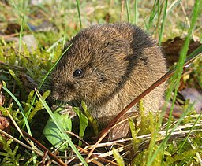
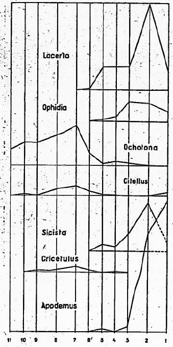
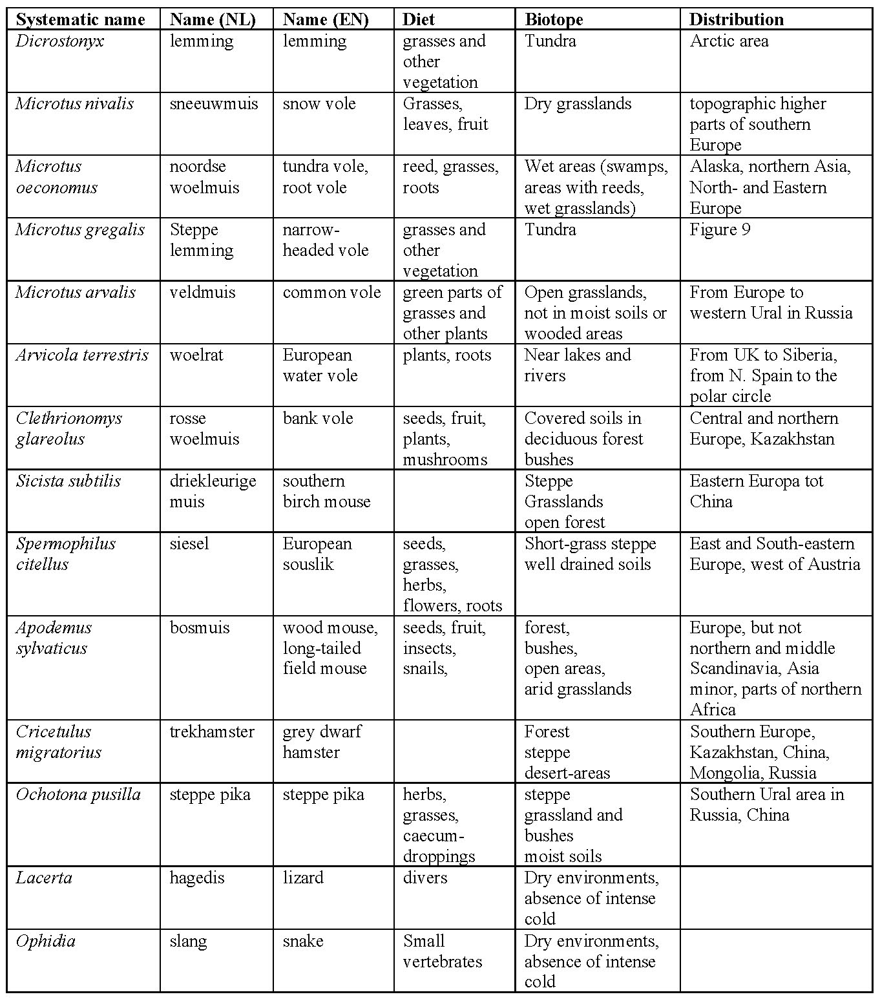
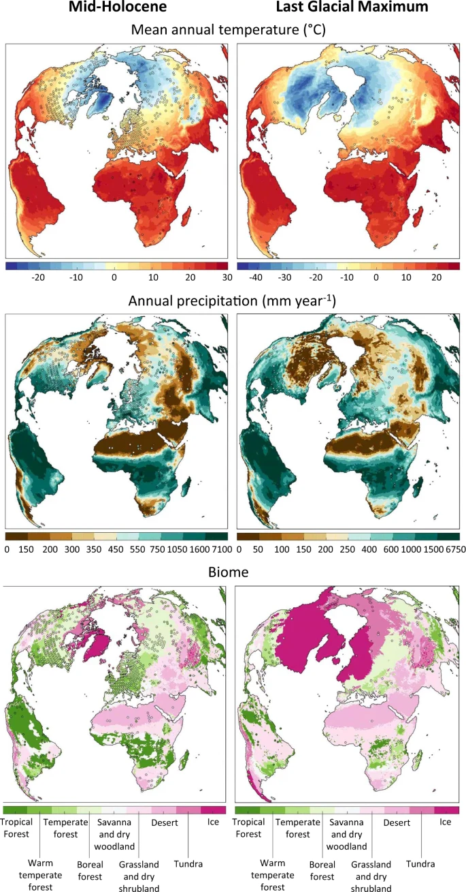

# Reconstruction of Pleistocene climate based on assemblages of mammal
microfossils from a cave in Hungary
Emilia Jarochowska & Wilma Wessels (Utrecht University)

# Instructions for a practical in data analysis

## 1. Purpose

Voles are rodents that are predominantly herbivorous and live in
burrows. Vole populations can grow very large in a short time due to a
high reproduction rate. Each species has a distinctive dentition (with
prismatic hypsodont teeth) and is associated with a specific type of
food and environment. Voles are widely used in the terrestrial fossil
record to interpret paleoecology and paleoclimate, because their ecology
makes them good environmental indicators:

- High abundance - it is possible to make quantitative studies and
  evaluate statistically the precision of ecological reconstructions
- Small size - it is possible to find a large fossil assemblage in a
  relatively small volume of rock or sediment (e.g. when outcrop area is
  limited or when we have to ship the samples to the lab - try this with
  a triceratops!)
- High preservation potential - as you already know, teeth are covered
  with a highly mineralized layer of enamel, which contains the mineral
  apatite. This makes teeth very resistant to chemical dissolution and
  mechanical fragmentation.
- High rates of morphological evolution - each species has different
  teeth
- Clear link between the morphology and diet (and thus vegetation
  available). By studying teeth alone we can tell what food was
  available in the animal’s habitat.

Dieter TD, first upload in de wikipedia on 13:31, 28. Apr 2005 by Dieter
TD, CC BY-SA 3.0 \<http://creativecommons.org/licenses/by-sa/3.0/\>, via
Wikimedia Commons

This practical consists of two parts:

1.  The mammal succession in Pleistocene and Holocene deposits in the
    Yankovich cave (Hungary) is used to reconstruct the climate in the
    area. The succession comes from 11 successive layers in a 3 meters
    high section. The total material collected consists of some 20 000
    fossils of large and small mammals.

\[\]

The Yankovich Cave is situated about 40 kilometers NW of Budapest
(Hungary) near Bajót. Its altitude is about 330 m.

Hungary has a relatively dry continental climate, with cold winters and
warm summers. Average temperatures range from -1°C in January to 21°C in
July. Rainfall is heaviest in early summer, and the average amount
decreases from 787 millimeters along the western frontier to 508
millimeters in the east.

The first study using quantitative data from a succession of fossil
rodent assemblages for paleoecological and paleoclimatic interpretations
was by Kretzoi (1957).

2.  The reconstructed biotopes are compared with biomes calculated from
    a global climate model.

## 2. Objectives

After finishing this practical, you should be able to:

1.  Understand how the nearest living relative principle is used to
    reconstruct past environments
2.  Use the present-day distributions and habitats of rodents for the
    interpretation of a late Pleistocene to Holocene faunal succession
3.  Carry out a quantitative analysis of changes in the composition of
    ecological groups of fossil fauna
4.  Use a dataset from a published article to extract climate
    information you need
5.  Document your analyses in a document (notebook or Markdown file)
    that and allows any scientist or fellow student to reproduce them
    without you being around.

## 3. Analysis of microfossil remains

### 3.1. Vole assemblages

Table 2 attached as a CSV file contains the relative frequencies of
voles in the Yankovich cave. To make the findings comparable, first
lower molars were counted, so e.g. if one individual left multiple teeth
preserved, we wouldn’t count it twice. You will use this data to
construct an area chart. On the horizontal axis should be the age and on
the vertical axis should be the relative proportion of each species in
the assemblage.

You will discover that some beds have the same age. Why could this be?
What are geological and methodological explanations for this? Propose a
solution on how to plot it so the plot remains legible.

### 3.2. Biotope reconstruction

Use the nearest living relative priniciple to reconstruct the
environment of the fossils from the cave. Make a new version of Table 2,
but instead of showing the proportions of taxa, extract the biotope from
Table 3 and apply it in the new version of Table 2. You are aiming for
an area chart that shows the relative proportions of biotopes. So you
may need to re-calculate the proportions. You can modify the code from
3.1, but make sure the labels are adjusted accordingly.

### 3.3. Assemblages of other vertebrates

In Table 4, also attached as a CSV file, the presence of other
vertebrates other than voles is shown. Make the same set of area charts
as in 3.1 and 3.2, but for these taxa. You will again have to modify the
code and use the information from Table 3 to plot changes in organisms
living in different biotopes. Is the biotope area chart the same as in
3.2?

## 4. Taxonomic richness

Tables 3 and 4 contain taxa found in each layer in the cave. Make two
bar plots, showing the species richness and genus richness across time.
For that purpose, you need to generate a variable showing the number of
species and genera, respectively, found in each layer. This will be the
height of the bar (vertical axis).

## 5. Rank abundance curves

[Rank abundance
curves](https://en.wikipedia.org/wiki/Rank_abundance_curve) are used in
ecology to show how balanced an ecosystem is: is it dominated by one
taxon or are there similar proportions of each taxa? In this step, you
have to sort the species based on how abundant it is in the fossil
assemblage. It has to be calculated for each layer in the cave. The most
abundant taxon has the lowest rank (1) and the least abundant - the
lowest. Once you sorted the species based on abundance, you can make a
plot where the rank is on the horizontal axis and the abundance on the
vertical axis. Generate the plot one after another, in stratigraphic
order, i.e. the oldest at the bottom. How did the ecosystem change over
time? Did it go from less to more balanced or *vice versa*?

## 6. Comparison with biomes from a climate model

Are fossil mammals good indicators of past climate and vegetation? We
can find out by comparing with past vegetation. But how? The most
important sources of information are pollen records and climate models.
The latter often include information from the former. Here we show you
one of several possible examples of obtaining data on past vegetation.
This example relies on Open Science: an approach that requires authors
of all studies to make their data and code available to anyone who would
like to reproduce their results. Beyer et al. (2020) generated a model
reoconstructing biomes on the Earth for the last 120 000 years. Biomes
in palaeoclimatology have very standardized definitions and their
occurrence can be predicted for palaeoclimatic data (Kaplan et
al. 2003). The data generated by the model can be downloaded from a
[public
repository](https://figshare.com/articles/dataset/LateQuaternary_Environment_nc/12293345/4)
(warning: big file!) and the authors provided the code to extract the
information from it in
[R](https://figshare.com/articles/dataset/LateQuaternary_Environment_nc/12293345/4?file=22659941)
and
[Python](https://figshare.com/articles/dataset/LateQuaternary_Environment_nc/12293345/4?file=22659938).

This file is distributed under the Creative Commons Attribution 4.0
International License: http://creativecommons.org/licenses/by/4.0/

You can change the age in the code to generate maps of biomes for the
ages of the faunal samples in this assignments. It is up to you how many
maps you generate: look at the area chart and see when big climatic
changes should happen: are they reflected in the map of biomes in
Europe?

## 7. References

Beyer, R.M., Krapp, M. & Manica, A. (2020) High-resolution terrestrial
climate, bioclimate and vegetation for the last 120,000 years. Sci Data
7, 236 https://doi.org/10.1038/s41597-020-0552-1

Kaplan, J. O., et al. (2003) Climate change and Arctic ecosystems: 2.
Modeling, paleodata-model comparisons, and future projections, J.
Geophys. Res., 108, 8171, doi:10.1029/2002JD002559, D19.

Kretzoi M. (1957) Folia Archaeologica, 9, pp. 16 - 21

## 8. Final report

Hand in an document as recommended by the teacher (e.g. Jupyter
notebook, Pluto notebook, R Markdown etc.). Write a report text as you
would for any analysis, but include the code corresponding to the steps
you’ve taken in the analysis and the output.

Address the following topics: What is the difference between a biotope
and a biome and how does this affect the comparison between the two
methods? What are the limitations of both ways of reconstructing
palaeoclimate? Are there any limitations of the nearest living relative
principle? What in the nature of the geological record, and specifically
in caves, could bias this analysis?

Use formatting to split your document into chapters, pay attention to
the spelling, especially to the use of taxon names. You don’t have to
include the files provided with the assignment unless you have modified
them.
