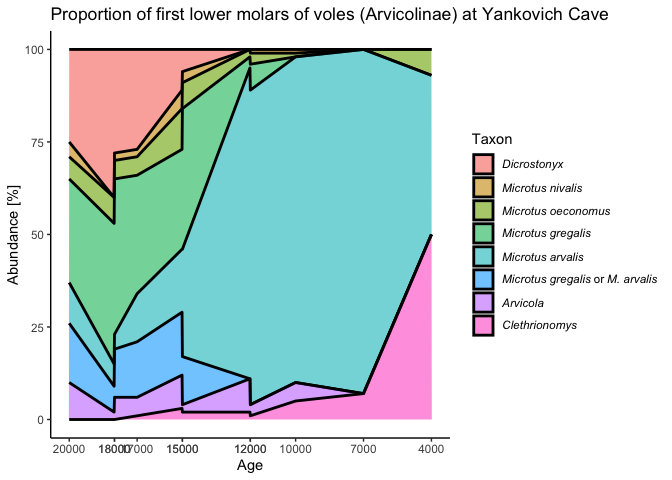
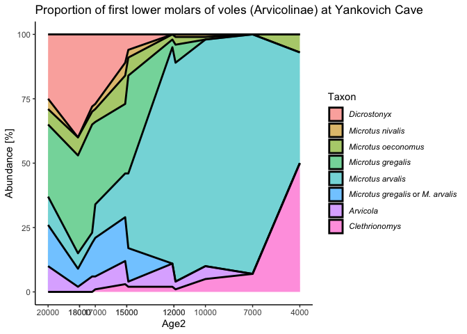
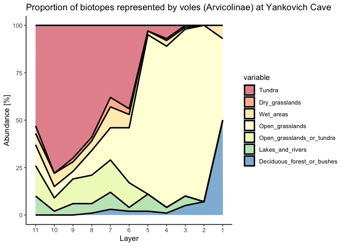
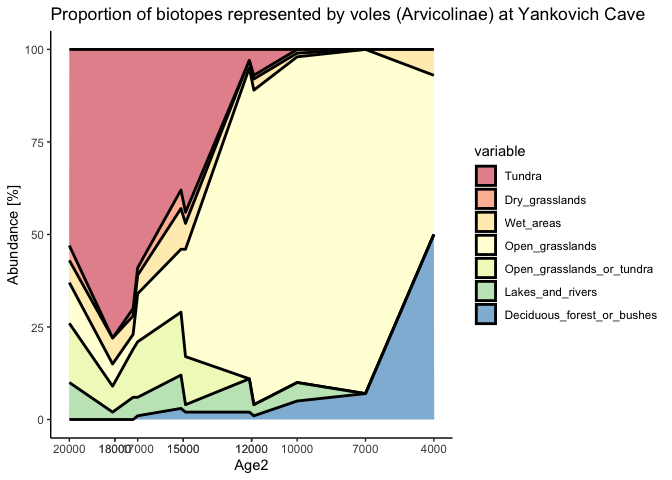
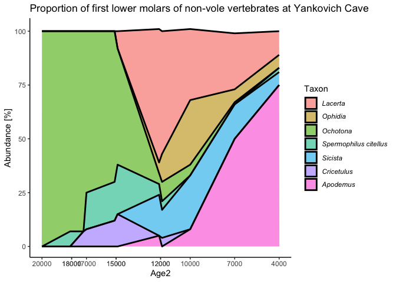
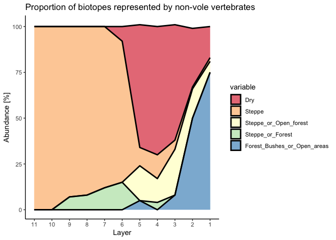
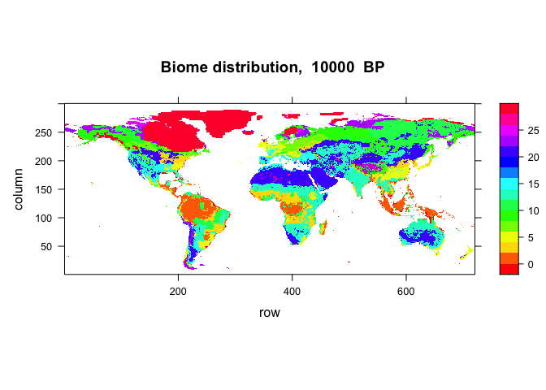
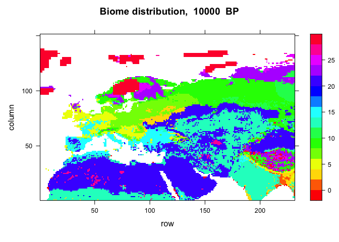
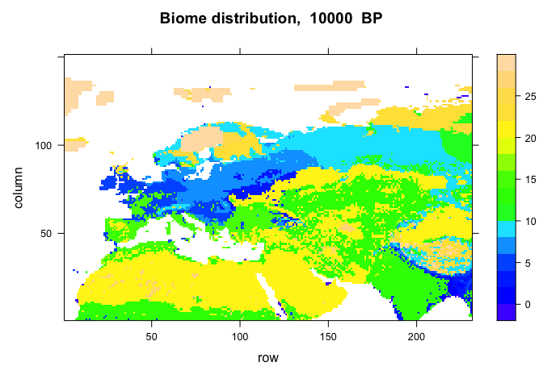

# R solution: Reconstruction of Pleistocene climate
Emilia Jarochowska and Wilma Wessels (Utrecht University)

This is a possible solution to the exercise [“Reconstruction of
Pleistocene climate based on assemblages of mammal microfossis from a
cave in Hungary”](https://github.com/EmiliaJarochowska/Yankovich_cave).

The instructions and solution use data from the following papers:

- Beyer, R.M., Krapp, M. & Manica, A. (2020) High-resolution terrestrial
  climate, bioclimate and vegetation for the last 120,000 years. *Sci
  Data* 7, 236 https://doi.org/10.1038/s41597-020-0552-1

- Kretzoi M. (1957) *Folia Archaeologica*, 9, pp. 16 - 21

and datasets and code from:

- Beyer, R. (2020) Late Quaternary climate, bioclimate and vegetation.
  figshare. Dataset. https://doi.org/10.6084/m9.figshare.12293345.v4,
  distributed under the [CC BY 4.0
  license](https://creativecommons.org/licenses/by/4.0/).

## 3. Analysis of microfossil remains

### 3.1. Vole assemblages

The proportions are provided in a table extracted from the figure in the
article by Kretzoi, but it is in the so called “wide format”.

``` r
Table2 <- read.csv(file="../data/Table2.csv", header=T, sep = ",")
```

For `ggplot2` it needs to be in the “long format”:

``` r
T2_long <- reshape2::melt(Table2, measure.vars=colnames(Table2)[3:10])
```

Area chart with correctly formatted taxonomic names:

``` r
ggplot(T2_long, aes(x=Layer, y=value, fill=variable)) + 
  geom_area(alpha=0.6 , linewidth=1, colour="black")+
  theme_classic()+
  scale_x_reverse(breaks=Table2$Layer)+
  ylab("Abundance [%]")+
  scale_fill_discrete(name = "Taxon", 
                      labels = c(expression(italic("Dicrostonyx")),                 
                      expression(italic("Microtus nivalis")),            
                      expression(italic("Microtus oeconomus")),          
                      expression(italic("Microtus gregalis")),           
                      expression(italic("Microtus arvalis")),            
                      expression(italic("Microtus gregalis")~ "or"~italic("M. arvalis")),
                      expression(italic("Arvicola")),
                      expression(italic("Clethrionomys"))))+
  theme(legend.text.align = 0)+
  ggtitle("Proportion of first lower molars of voles (Arvicolinae) at Yankovich Cave")
```


The same plot but with age on the horizontal axis:

``` r
ggplot(T2_long, aes(x=Age, y=value, fill=variable)) + 
  geom_area(alpha=0.6 , linewidth=1, colour="black")+
  theme_classic()+
  scale_x_reverse(breaks=Table2$Age)+
  ylab("Abundance [%]")+
  scale_fill_discrete(name = "Taxon", 
                      labels = c(expression(italic("Dicrostonyx")),                 
                      expression(italic("Microtus nivalis")),
                      expression(italic("Microtus oeconomus")),
                      expression(italic("Microtus gregalis")),
                      expression(italic("Microtus arvalis")),
                      expression(italic("Microtus gregalis") ~ "or" ~
                                 italic("M. arvalis")),
                      expression(italic("Arvicola")),
                      expression(italic("Clethrionomys"))))+
  theme(legend.text.align = 0)+
  ggtitle("Proportion of first lower molars of voles (Arvicolinae) at Yankovich Cave")
```



Students can choose how to deal with this: average percentages per age
bin or add a small number to differentiate between two layers which had
been assigned the same age. I personally prefer the latter solution so
here’s one way how to do that.

``` r
Table2$Age2<-c(20000, 18100, 17200, 17000, 15100, 14900, 12100, 11900, 10000,  7000,  4000)
T2_long <- reshape2::melt(Table2, measure.vars=colnames(Table2)[3:10])
```

We can then use the same code with the variable `Age2` we created. Note
that I left the axis tick labels defined by the old variable `Age`,
otherwise it would show the new “dummy” ages, which we modified but are
not entirely true.

``` r
ggplot2::ggplot(T2_long, aes(x=Age2, y=value, fill=variable)) + 
  geom_area(alpha=0.6 , linewidth=1, colour="black")+
  theme_classic()+
  scale_x_reverse(breaks=Table2$Age)+
  ylab("Abundance [%]")+
  scale_fill_discrete(name = "Taxon", 
                      labels = c(expression(italic("Dicrostonyx")),                 
                      expression(italic("Microtus nivalis")),
                      expression(italic("Microtus oeconomus")),
                      expression(italic("Microtus gregalis")),
                      expression(italic("Microtus arvalis")),
                      expression(italic("Microtus gregalis") ~ "or" ~
                                              italic("M. arvalis")),
                      expression(italic("Arvicola")),
                      expression(italic("Clethrionomys"))))+  theme(legend.text.align = 0)+
  ggtitle("Proportion of first lower molars of voles (Arvicolinae) at Yankovich Cave")
```



### 3.2. Biotope reconstruction

The anticipated problems are that the students will use complete (very
long) names of biotopes in the variable names and this may cause issues
with import. In the file I created (`Table2_habitats.csv`) the names are
shortened and don’t use space characters - this can be advised to
students. A second issue may be that two taxa come from Tundra, so if we
code them as Tundra, these variables will be imported into R as `Tundra`
and `Tundra.1` because in R you can’t have two variables with the same
name. Here I sum them into one and then drop the second.

``` r
Table2h <- read.csv(file="data/Table2_habitats.csv", header=T, sep = ",")
Table2h$Tundra <- Table2h$Tundra+Table2h$Tundra.1
Table2h<-Table2h[,-6]
Table2h_long <- reshape2::melt(Table2h, measure.vars=colnames(Table2h)[3:9])
```

If all this worked, we can plot:

``` r
ggplot2::ggplot(Table2h_long, aes(x=Layer, y=value, fill=variable)) + 
  geom_area(alpha=0.6 , linewidth=1, colour="black")+
  theme_classic()+
  scale_x_reverse(breaks=Table2h$Layer)+
  ylab("Abundance [%]")+
  theme(legend.text.align = 0)+
  ggtitle("Proportion of biotopes represented by voles (Arvicolinae) at Yankovich Cave")+
  scale_fill_brewer(palette="Spectral")
```



And the same for ages:

``` r
Table2h$Age2<-c(20000, 18100, 17200, 17000, 15100, 14900, 12100, 11900, 10000,  7000,  4000)
Table2h_long <- reshape2::melt(Table2h, measure.vars=colnames(Table2h)[3:9])
```

``` r
ggplot2::ggplot(Table2h_long, aes(x=Age2, y=value, fill=variable)) + 
  geom_area(alpha=0.6 , linewidth=1, colour="black")+
  theme_classic()+
  scale_x_reverse(breaks=Table2h$Age)+
  ylab("Abundance [%]")+
  theme(legend.text.align = 0)+
  ggtitle("Proportion of biotopes represented by voles (Arvicolinae) at Yankovich Cave")+
  scale_fill_brewer(palette="Spectral")
```



### 3.3. Assemblages of other vertebrates

We use the provided `Table4.csv`:

``` r
Table4 <- read.csv(file="../data/Table4.csv", header=T, sep = ",")
df4 <- reshape2::melt(Table4, measure.vars=colnames(Table4)[3:9])
```

The students also have to change some plot parameters:

``` r
ggplot2::ggplot(df4, aes(x=Layer, y=value, fill=variable)) + 
  geom_area(alpha=0.6 , linewidth=1, colour="black")+
  theme_classic()+
  scale_x_reverse(breaks=Table4$Layer)+
  ylab("Abundance [%]")+
  scale_fill_discrete(name = "Taxon", 
                      labels = c(expression(italic("Lacerta")),                 
                      expression(italic("Ophidia")),            
                      expression(italic("Ochotona")),          
                      expression(italic("Spermophilus citellus")),           
                      expression(italic("Sicista")),            
                      expression(italic("Cricetulus")),
                      expression(italic("Apodemus"))))+
  theme(legend.text.align = 0)+
  ggtitle("Proportion of first lower molars of non-vole vertebrates at Yankovich Cave")
```


We again re-plot with ages instead of layer numbers:

``` r
Table4$Age2<-c(20000, 18100, 17200, 17000, 15100, 14900, 12100, 11900, 10000,  7000,  4000)
df4 <- reshape2::melt(Table4, measure.vars=colnames(Table4)[3:9])
```

``` r
ggplot2::ggplot(df4, aes(x=Age2, y=value, fill=variable)) + 
  geom_area(alpha=0.6 , linewidth=1, colour="black")+
  theme_classic()+
  scale_x_reverse(breaks=Table4$Age)+
  ylab("Abundance [%]")+
  scale_fill_discrete(name = "Taxon", 
                      labels = c(expression(italic("Lacerta")),                 
                      expression(italic("Ophidia")),            
                      expression(italic("Ochotona")),          
                      expression(italic("Spermophilus citellus")),           
                      expression(italic("Sicista")),            
                      expression(italic("Cricetulus")),
                      expression(italic("Apodemus"))))+
  theme(legend.text.align = 0)+
  ggtitle("Proportion of first lower molars of non-vole vertebrates at Yankovich Cave")
```


The students need to create a version of Table 4 with biotopes instead
of taxa. Here is importing the file I created:

``` r
Table4h <- read.csv(file="data/Table4_habitats.csv", header=T, sep = ",")
Table4h$Dry <- Table4h$Dry+Table4h$Dry.1
Table4h<-Table4h[,-4]
Table4h$Steppe <- Table4h$Steppe+Table4h$Steppe.1
Table4h<-Table4h[,-5]
df4h <- reshape2::melt(Table4h, measure.vars=colnames(Table4h)[3:7])
```

The number of environments may differ depending on how the students code
them.

``` r
ggplot2::ggplot(df4h, aes(x=Layer, y=value, fill=variable)) + 
  geom_area(alpha=0.6 , linewidth=1, colour="black")+
  theme_classic()+
  scale_x_reverse(breaks=Table4h$Layer)+
  ylab("Abundance [%]")+
  theme(legend.text.align = 0)+
  ggtitle("Proportion of biotopes represented by non-vole vertebrates")+
  scale_fill_brewer(palette="Spectral")
```



And, again, the same for ages:

``` r
Table4h$Age2<-c(20000, 18100, 17200, 17000, 15100, 14900, 12100, 11900, 10000,  7000,  4000)
df4h <- reshape2::melt(Table4h, measure.vars=colnames(Table4h)[3:7])
```

And the final plot:

``` r
ggplot2::ggplot(df4h, aes(x=Age2, y=value, fill=variable)) + 
  geom_area(alpha=0.6 , linewidth=1, colour="black")+
  theme_classic()+
  scale_x_reverse(breaks=Table4h$Age)+
  ylab("Abundance [%]")+
  theme(legend.text.align = 0)+
  ggtitle("Proportion of biotopes represented by non-vole vertebrates")+
  scale_fill_brewer(palette="Spectral")
```



You can see a rounding error as some layers have the total different
from 100% but we can ignore that.

## 4. Comparison with biomes from a climate model

The code for extracting data from the model is [available on
figshare](https://figshare.com/articles/dataset/LateQuaternary_Environment_nc/12293345/4?file=22659941).
It refers to the file `LateQuaternary_Environment.nc`. Both the code and
the file can be downloaded using the web interface of figshare or the
download can be included in the code, which makes the entire project
more reproducible.

### 4.1 Download the data directly into the R environment

There are several ways. The one shown here uses
[datahugger](https://pypi.org/project/datahugger/), a Python package for
downloading data from all major scientific data repositories. It can be
called from R, but requires Python to be installed on the computer.
Downloading the `LateQuaternary_Environment.nc` file may take a while,
it is 1.24 GB.

```` markdown
```{r}
#| output: false
library(reticulate)
py_install("datahugger")
dh <- import("datahugger")
```
````

```` markdown
```{r}
dh_data <- dh$get("https://doi.org/10.6084/m9.figshare.12293345.v4", "data")
```
````

After this the climate model file will be in the `/data` folder, as well
as the R script. We could `source` this file or [parts of
it](https://gist.github.com/klmr/3551433), but we will still need to
change the parameters. So we have two options:

1.  Ask the students to turn that script into a function that plots the
    biomes for a particular age.
2.  Run a few instances of the script with different parameters.

Should we go for 2., we need to read in the file:

``` r
file <- "data/LateQuaternary_Environment.nc";

env_nc      <- ncdf4::nc_open(file)
years       <- ncdf4::ncvar_get(env_nc, "time")
biome       <- ncdf4::ncvar_get(env_nc, "biome")
ncdf4::nc_close(env_nc)
```

Set the year for which the plot should be generated:

``` r
my_year      <- -10000
```

``` r
p1 <- print(lattice::levelplot(biome[,,years == my_year], 
                               main = paste("Biome distribution, ", -1*my_year, " BP"), 
                               col.regions=rainbow(28)))
```



This plot was for the entire world, but we may want to focus on Europe
and have a closer look:

``` r
p1 <- print(lattice::levelplot(biome[,,years == my_year][320:550,150:300], 
                               main = paste("Biome distribution, ", -1*my_year, " BP"), 
                               col.regions=rainbow(28)))
```



These colors are a bit toxic, but give high contrast. If you want to
change the palette, you can try substituting `rainbow(28)` with
`terrain.color(28)`, `heat.colors(28)`, `topo.colors(28)` or
`cm.colors(28)`.

``` r
p1 <- print(lattice::levelplot(biome[,,years == my_year][320:550,150:300], 
                               main = paste("Biome distribution, ", -1*my_year, " BP"), 
                               col.regions=topo.colors(28)))
```



But the biome scale is in numbers, not names! What now? Biomes are
standardized in this widely used model, so each number has a fixed
meaning:

0.  ‘Tropical evergreen forest’,

1.  ‘Tropical semi-deciduous forest’,

2.  ‘Tropical deciduous forest/woodland’,

3.  ‘Temperate deciduous forest’,

4.  ‘Temperate conifer forest’,

5.  ‘Warm mixed forest’,

6.  ‘Cool mixed forest’,

7.  ‘Cool conifer forest’,

8.  ‘Cold mixed forest’,

9.  ‘Evegreen taiga/montane forest’,

10. ‘Deciduous taiga/montane forest’,

11. ‘Tropical savanna’,

12. ‘Tropical xerophytic shrubland’,

13. ‘Temperate xerophytic shrubland’,

14. ‘Temperate sclerophyll woodland’,

15. ‘Temperate broadleaved savanna’,

16. ‘Open conifer woodland’,

17. ‘Boreal parkland’,

18. ‘Tropical grassland’,

19. ‘Temperate grassland’,

20. ‘Desert’,

21. ‘Steppe tundra’,

22. ‘Shrub tundra’,

23. ‘Dwarf shrub tundra’,

24. ‘Prostrate shrub tundra’,

25. ‘Cushion-forbs, lichen and moss’,

26. ‘Barren’,

27. ‘Land ice’

You can tweak the legend of the plots to display these names.
